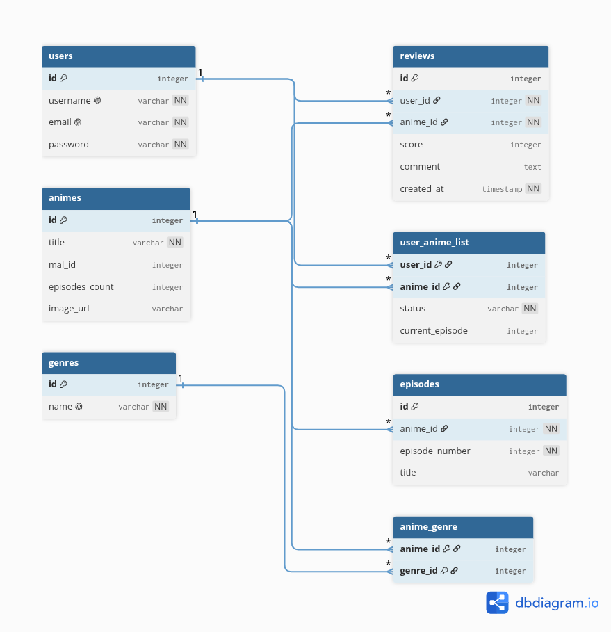

# Gahramheit - Plataforma Social de Gestión y Resumen Anual de Anime

**Curso:** CS 2031 Desarrollo Basado en Plataforma  
**Entrega:** Semana 9 - Culminación del Backend

## Nombres de los Integrantes
| Nombre Completo                                                               | Código     |
|:------------------------------------------------------------------------------|:-----------|
| Miguel Angel de Santa Maria Villena Bustamante                                | 202510702  |
| Edinson Brando Ricardo Vasquez Mamani                                         | 202510680  |
| John Dayron Blas Huete                                                        | 202510794  |
| Daniel Mateo Dongo Triveño                                                    | 202310506  | 
| Guillermo Arturo Heredia Cadenas                                              | 202410219  |

---

## Índice / Tabla de Contenidos
- [Gahramheit - Plataforma Social de Gestión y Resumen Anual de Anime](#gahramheit---plataforma-social-de-gestión-y-resumen-anual-de-anime)
  - [Nombres de los Integrantes](#nombres-de-los-integrantes)
  - [Índice / Tabla de Contenidos](#índice--tabla-de-contenidos)
  - [1. Introducción](#1-introducción)
    - [Contexto](#contexto)
    - [Objetivos del Proyecto](#objetivos-del-proyecto)
  - [2. Identificación del Problema o Necesidad](#2-identificación-del-problema-o-necesidad)
    - [Descripción del Problema](#descripción-del-problema)
    - [Justificación](#justificación)
  - [3. Descripción de la Solución](#3-descripción-de-la-solución)
    - [Funcionalidades Implementadas](#funcionalidades-implementadas)
    - [Tecnologías Utilizadas](#tecnologías-utilizadas)
  - [4. Modelo de Entidades](#4-modelo-de-entidades)
    - [Diagrama de Entidades](#diagrama-de-entidades)
    - [Descripción de Entidades](#descripción-de-entidades)
  - [5. Testing y Manejo de Errores](#5-testing-y-manejo-de-errores)
    - [Niveles de Testing Realizados](#niveles-de-testing-realizados)
    - [Resultados](#resultados)
    - [Manejo de Errores](#manejo-de-errores)
  - [6. Medidas de Seguridad Implementadas](#6-medidas-de-seguridad-implementadas)
    - [Seguridad de Datos](#seguridad-de-datos)
    - [Prevención de Vulnerabilidades](#prevención-de-vulnerabilidades)
  - [7. Eventos y Asincronía](#7-eventos-y-asincronía)
  - [8. GitHub \& Management](#8-github--management)
  - [9. Conclusión](#9-conclusión)
  - [10. Apéndices](#10-apéndices)
    - [Licencia](#licencia)
  - [11. Referencias](#11-referencias)

---

## 1. Introducción

### Contexto
El consumo de contenido multimedia, específicamente el anime, ha experimentado un crecimiento exponencial a nivel global en los últimos años. Sin embargo, a medida que el catálogo de series disponibles se expande en múltiples servicios de streaming, los consumidores encuentran dificultades crecientes para mantener un registro organizado e histórico de sus hábitos de visualización. En este contexto, surge la necesidad de una plataforma que centralice el seguimiento de series y capítulos, convirtiéndose en el ecosistema principal del usuario para interactuar con la comunidad otaku.

### Objetivos del Proyecto
* **Objetivo General:** Desarrollar una plataforma backend robusta, escalable y segura para la gestión social de anime, permitiendo catalogar consumos individuales y automatizar un "Yearly Recap".
* **Objetivos Específicos:**
    * Implementar una arquitectura limpia en capas utilizando Spring Boot que integre servicios de persistencia y consumo de APIs de terceros de manera eficiente
    * Diseñar un algoritmo de procesamiento de datos para la generación asíncrona de los "Yearly Recap" sin degradar la performance del servidor.
    * Garantizar la integridad de los datos de los usuarios mediante la incorporación de estrictas medidas de seguridad, validaciones de entrada de datos y control de accesos basados en roles.

---

## 2. Identificación del Problema o Necesidad

### Descripción del Problema
Los fanáticos del anime o mangas se enfrentan al problema recurrente de perder el rastro exacto de las series que consumen, los episodios vistos y las fechas de emisión. Actualmente, no existe una herramienta unificada en el mercado que aborde este seguimiento desde una perspectiva emocional y visual, privando a los usuarios de una forma interactiva de recapitular, revivir y compartir su comportamiento de consumo anual (al estilo de las aplicaciones líderes de streaming de música) con su círculo social o comunidades digitales.

### Justificación
Solucionar esta problemática es sumamente relevante porque el software no solo funciona como un organizador funcional de tareas de visualización, sino que añade un valor social e identitario fundamental para el usuario. Al proveer métricas personalizadas y espacios de debate centralizados, se mitiga la fragmentación de la información de consumo y se fomenta la retención de los usuarios en una plataforma que celebra sus hábitos culturales de entretenimiento a través de mecánicas de gamificación y análisis de datos.

---

## 3. Descripción de la Solución

### Funcionalidades Implementadas
La plataforma backend de **Gahramheit** posee los servicios necesarios para soportar las siguientes capacidades operativas, las cuales componen el núcleo de nuestro MVP:
1. **Búsqueda de Anime y Catálogo:** Sincronización en tiempo real con catálogos externos para consultar fichas técnicas, sinopsis, casas animadoras y actores de doblaje.
2. **Seguimiento Dinámico (Watchlist):** Gestión individualizada del progreso de visualización, permitiendo marcar episodios específicos como vistos y categorizar el estado de la serie en la lista personal del usuario.
3. **Sistema de Calificación y Feedback (Rating):** Persistencia de puntuaciones numéricas y comentarios escritos sobre series completas o episodios de forma independiente.
4. **Foros de Discusión Comunitarios:** Habilitación de espacios de interacción social segmentados por serie, permitiendo la comunicación directa entre los usuarios de la plataforma.
5. **Generador Automatizado de "Wrap" (Yearly Recap):** Algoritmo analítico encargado de agrupar hábitos de consumo, calcular tiempos totales de visualización y deducir géneros favoritos a fin de añ.
6. **Sistema de Recompensas y Logros:** Gamificación integrada que otorga insignias de mérito (ej. "Maestro del Shonen") al completar metas del perfil.

### Tecnologías Utilizadas
* **Lenguaje de Programación:** Java 21
* **Framework Principal:** Spring Boot (Spring Web, Spring Security)
* **Persistencia de Datos:** Spring Data JPA con Hibernate
* **Bases de Datos:** Neon (PostgreSQL)
* **APIs Externas:** [Jikan API](https://jikan.moe/) (API REST gratuita basada en MyAnimeList)
* **Herramientas:** Lombok, Validation, ModelMapper 

---

## 4. Modelo de Entidades

### Diagrama de Entidades

### Descripción de Entidades
[Explicar detalladamente las entidades principales del negocio, detallando sus atributos más representativos y los tipos de relaciones implementadas entre ellas, por ejemplo: @OneToMany, @ManyToOne, @ManyToMany, indicando las configuraciones de cascade types o fetch types optimizados.]

---

## 5. Testing y Manejo de Errores

### Niveles de Testing Realizados
[Describir los niveles de prueba automatizados que se incorporaron al proyecto para asegurar la calidad de la entrega, tales como pruebas unitarias de repositorios con `@DataJpaTest`, de servicios con `Mockito` o pruebas de integración de controladores utilizando `@WebMvcTest`/`@SpringBootTest` con `MockMvc` o `TestContainers`.]

### Resultados
[Resumir cuantitativa o cualitativamente los resultados arrojados por las pruebas, detallando cuáles fueron los principales errores o fallos lógicos encontrados y cómo se corrigieron con éxito.]

### Manejo de Errores
[Explicar en términos generales el diseño de excepciones globales utilizadas a través de un `@ControllerAdvice`/`@RestControllerAdvice` y la importancia que tiene centralizar las excepciones de dominio y de infraestructura para garantizar respuestas estandarizadas al cliente.]

---

## 6. Medidas de Seguridad Implementadas

### Seguridad de Datos
[Explicar detalladamente las técnicas adoptadas para garantizar el resguardo de la información sensible, como el uso de Spring Security para asegurar los endpoints de la aplicación, el algoritmo BCrypt para la encriptación de contraseñas y el estándar de tokens JWT para el proceso de login y gestión de roles.]

### Prevención de Vulnerabilidades
[Describir los mecanismos establecidos de forma nativa en el backend o por configuración manual para prevenir ataques informáticos comunes y fallos de seguridad críticos, como Inyección SQL, Cross-Site Scripting (XSS) y Cross-Site Request Forgery (CSRF).]

---

## 7. Eventos y Asincronía
[Detallar meticulosamente qué eventos del sistema fueron utilizados (ej. registro de usuario, transacciones bancarias), explicar la relevancia de implementarlos bajo la arquitectura orientada a eventos para desacoplar componentes y justificar técnicamente los motivos por los cuales el procesamiento (como envío de correos HTML o notificaciones) debe ser asincrónico mediante `@Async`.]

---

## 8. GitHub & Management
[Describir con precisión la manera en que el equipo organizó el flujo de trabajo utilizando herramientas de gestión como GitHub Projects o GitHub Issues, detallando la asignación de tareas, etiquetas (labels) y cumplimiento de deadlines.]

[Asimismo, detallar el uso de GitHub Actions e ilustrar el flujo de integración continua (CI/CD) implementado de manera particular para compilar, probar o desplegar el backend.]

---

## 9. Conclusión

* **Logros del Proyecto:** [Resumir los hitos alcanzados y el impacto de la solución técnica backend diseñada frente al problema originalmente planteado.]
* **Aprendizajes Clave:** [Reflexionar sobre los conocimientos conceptuales o procedimentales más significativos obtenidos por los integrantes del equipo durante el proceso de desarrollo.]
* **Trabajo Futuro:** [Proponer y sugerir posibles mejoras de software, refactorizaciones arquitectónicas o nuevas extensiones funcionales para el sistema a mediano o largo plazo.]

---

## 10. Apéndices

### Licencia
Este proyecto se distribuye bajo la licencia [Especificar el tipo de licencia, ej. MIT License, Apache License 2.0, etc.].

---

## 11. Referencias
* [Referencia Bibliográfica 1 o Enlace Técnico utilizado]
* [Referencia Bibliográfica 2 o Documentación del API]